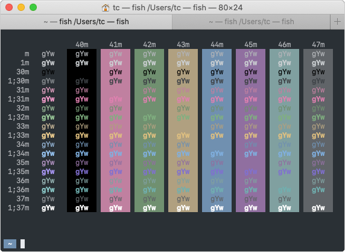
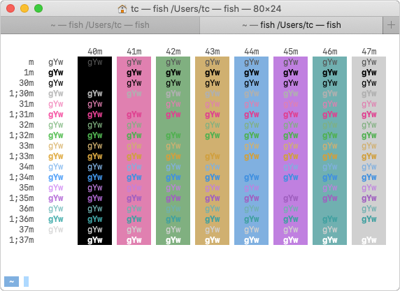

# canalia

macOS の Terminal.app のカラーテーマです。

ダーク系とライト系があります。

## スクリーンショット

## 設定方法

- ターミナル > 環境設定… > プロファイル を選択
- プロファイルリストの下部の 歯車 > 読み込む… を選択
- canalia dark.terminal または canalia light.terminal を選択
- 必要に応じて デフォルト に設定

### 追加の設定例

- テキスト
    - フォント: SF Mono Regular 12pt.
- シェル
    - シェルの終了時: シェルが正常に終了した場合は閉じる
- キーボード
    - 「メタキーとして Option キーを使用」をチェック
